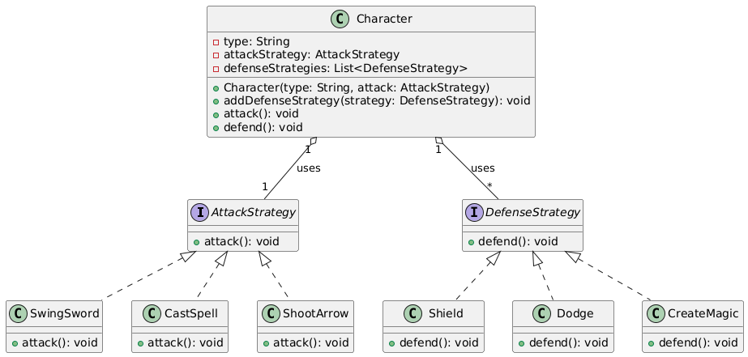

# Lab-Assignment-1-Strategy-Pattern

## Overview

This simple Java project demonstrates the Strategy design pattern. Characters (Knight, Wizard, Archer)
use interchangeable attack and defense strategies to perform actions at runtime.

## Problem scenario

Suppose we have three types of characters in a `GameApp`:

- **Knight**: Attacks with a sword; uses three defense strategies (shield, dodge, magic barrier).
- **Wizard**: Casts spells; uses a magic barrier to defend.
- **Archer**: Shoots arrows; uses dodge to defend.

There are two strategy interfaces:

- `AttackStrategy`
     - `CastSpell`
     - `ShootArrow`
     - `SwingSword`

- `DefenseStrategy`
     - `Shield`
     - `Dodge`
     - `CreateMagic`

## UML Diagram

The following diagram shows the relationships between the `Character` class and the strategy interfaces/implementations:



## Build & Run

Compile all `.java` files and run `GameApp`:

```bash
javac *.java
java GameApp
```

You should see output demonstrating each character's attack and defense actions.

## Project structure

- AttackStrategy.java
- DefenseStrategy.java
- SwingSword.java
- CastSpell.java
- ShootArrow.java
- Shield.java
- Dodge.java
- CreateMagic.java
- Character.java
- GameApp.java
- UMLDiagram.png

## Notes

- Each class/interface is defined in its own file to follow Java conventions.
- The UML image is included in the repository and referenced so it renders on GitHub.
